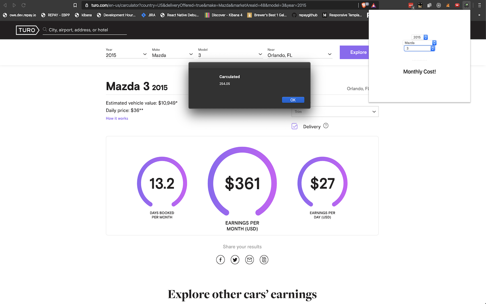

#  Carculated

Chrome extension built to calculate the true value of a car and balance that against Turo's carculator

## Install

[**Chrome** extension](https://chrome.google.com/webstore/detail/kapmfaejgkginljdobbfefhghaehciap)

## How it works
It computes the average insurance, maintenance and repairs and returns a monthly cost. You can then take that number and subtract it from turo’s number 361-254.05=106.95. So on average your 2015 Mazda 3 will profit 106.95 if you own it outright.

## Project Goals
Got plans in the future to interact directly with turo, maybe craigslist, maybe autotrader etc. It would be useful to see the cost to own on those 3 categories.
https://github.com/SkarDude/carculated/projects

## Local development
How to load chrome extension in browser?
Follow these instructions to load your extension in browser:

1. `npm run watch`
2. Open chrome://extensions
3. Check the Developer mode checkbox
4. Click on the Load unpacked extension button
5. Select the folder carculated/build
Note: build folder is created when you run either npm run watch (for development) or npm run build (for production) command.

## Contribution

Suggestions and pull requests are welcomed!
